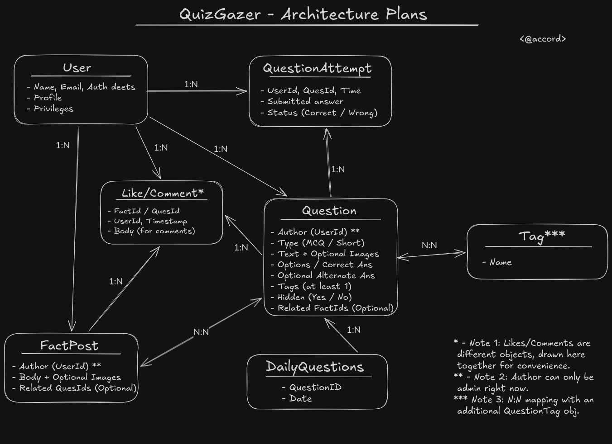

### Set up DB

#### Current objects:

```text
- User
- Question
- QuestionAttempt
- DailyQuestions
- FactPost
- QuestionComment
- FactComment
- QuestionLike
- FactLike
- Tag (TagQuestion object to map)
```

**Drew the diagram rn:**

